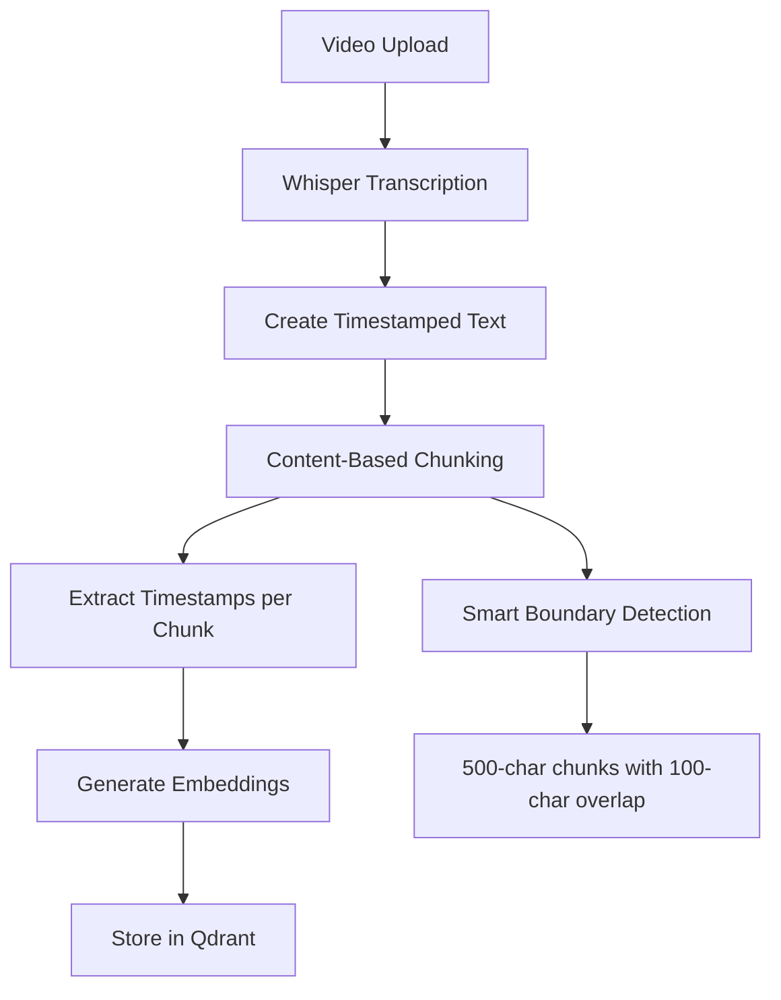

# Content-Based Video Chunking Implementation

## Overview

This document describes the implementation of content-based chunking for video transcripts in the CRM system. This change replaces the previous time-based chunking approach with a more sophisticated content-aware method that maintains consistent chunk sizes while preserving temporal information.

## Problem Statement

### Previous Time-Based Chunking Issues

**Original Approach:**
- Fixed 30-second time windows with 5-second overlap
- Variable chunk sizes (ranging from 200-1000+ characters)
- Inconsistent embedding quality due to size variations
- Limited semantic coherence within chunks

**Core Problems:**
1. **Inconsistent Chunk Sizes**: Some chunks were very small (200 chars), others very large (1000+ chars)
2. **Poor Embedding Quality**: Variable sizes led to inconsistent vector representations
3. **Arbitrary Time Boundaries**: Chunks could cut off mid-sentence or mid-concept
4. **Limited Context**: 30-second windows didn't always capture complete thoughts

### Example of Previous Issues
```
Time-Based Chunks:
Chunk 1 (30s): "[0.0s-12.1s] Welcome to our... [12.1s-30.0s] Today we'll cover thr-" (800 chars)
Chunk 2 (30s): "[25.0s-35.2s] -ee strategies..." (300 chars) 
Chunk 3 (30s): "[30.0s-60.0s] First is active listening..." (1200 chars)
```

## Solution: Content-Based Chunking

### New Approach
- **Fixed chunk size**: 500 characters per chunk (configurable)
- **Overlap**: 100 characters between chunks (configurable)
- **Embedded timestamps**: All timestamps preserved within text
- **Smart boundaries**: Chunks break at complete timestamps/sentences
- **LLM intelligence**: Let the LLM extract relevant timestamp ranges

### Architecture Changes

#### 1. Chunking Algorithm (`qdrant_services.py`)

**New Method: `_create_content_based_chunks()`**
```python
def _create_content_based_chunks(self, full_text, chunk_size, chunk_overlap):
    # Creates fixed-size chunks with intelligent breaking points
    # Ensures timestamps aren't cut mid-way
    # Maintains semantic boundaries where possible
```

**Key Features:**
- **Fixed Size**: Every chunk targets exactly 500 characters
- **Smart Breaking**: Breaks at timestamp ends (`] `) or sentence boundaries
- **Overlap Handling**: 100-character overlap prevents information loss
- **Boundary Safety**: Never cuts timestamps like `[25.4s-3...`

#### 2. Enhanced Metadata Structure

**Before:**
```json
{
  "text": "chunk content",
  "start_time": 30.0,
  "end_time": 60.0,
  "source_type": "video"
}
```

**After:**
```json
{
  "text": "[5.2s-12.1s] Welcome... [12.1s-18.9s] Today...",
  "chunk_type": "content_based",
  "timestamp_ranges": [
    {"start": 5.2, "end": 12.1},
    {"start": 12.1, "end": 18.9},
    {"start": 18.9, "end": 25.4}
  ],
  "start_time": 5.2,  // Overall range start
  "end_time": 25.4,   // Overall range end
  "source_type": "video"
}
```

#### 3. Timestamp Extraction (`_extract_timestamps_from_chunk()`)

**Purpose**: Extract all timestamp ranges from chunk text for metadata storage
```python
# Input text: "[5.2s-12.1s] Welcome [12.1s-18.9s] Today"
# Output: [{"start": 5.2, "end": 12.1}, {"start": 12.1, "end": 18.9}]
```

### Implementation Flow



## Benefits

### 1. Consistent Embedding Quality
- **Before**: Variable chunk sizes (200-1200 chars) → inconsistent embeddings
- **After**: Fixed 500-char chunks → consistent, high-quality embeddings

### 2. Better Semantic Retrieval
- **Consistent Size**: Equal-sized chunks improve similarity matching
- **Smart Boundaries**: Chunks end at natural breakpoints
- **Complete Context**: No mid-sentence cuts

### 3. Enhanced LLM Intelligence
- **Multiple Timestamps**: LLM can see all relevant time ranges in context
- **Flexible Extraction**: LLM chooses which timestamps to include in response
- **Better Context**: Can reference "earlier" or "later" parts intelligently

### 4. Scalability
- **No Token Limits**: Fixed chunk sizes work for any video length
- **Predictable Costs**: Consistent chunk sizes → predictable processing costs
- **Better Performance**: More efficient vector operations

## Example Walkthrough

### Input Video Transcript
```
Segments:
[0.0s-5.2s] "Welcome to our sales training program."
[5.2s-12.1s] "Today we'll cover three key strategies."
[12.1s-18.9s] "First is active listening and empathy."
[18.9s-25.4s] "This involves mirroring their communication style."
[25.4s-32.1s] "Second strategy is understanding customer needs."
```

### Content-Based Chunking Process
```
Step 1: Create full timestamped text (715 chars)
"[0.0s-5.2s] Welcome to our sales training program. [5.2s-12.1s] Today we'll cover three key strategies. [12.1s-18.9s] First is active listening and empathy. [18.9s-25.4s] This involves mirroring their communication style. [25.4s-32.1s] Second strategy is understanding customer needs."

Step 2: Create 500-char chunks with 100-char overlap
Chunk 1 (493 chars): "[0.0s-5.2s] Welcome... [25.4s-32.1s] Second strategy is understanding customer needs through effective questioning. [32.1s-38.7s]"

Chunk 2 (319 chars): "[32.1s-38.7s] Ask open-ended questions... [52.0s-58.5s] Always deliver on your promises..."

Step 3: Extract timestamps per chunk
Chunk 1 timestamps: [0.0s-5.2s], [5.2s-12.1s], [12.1s-18.9s], [18.9s-25.4s], [25.4s-32.1s], [32.1s-38.7s]
Chunk 2 timestamps: [32.1s-38.7s], [38.7s-45.3s], [45.3s-52.0s], [52.0s-58.5s]
```

### Query Processing Example
```
User Query: "How do I build rapport with customers?"

Qdrant Retrieval: Returns chunks containing rapport-related content
Retrieved Chunk: "[12.1s-18.9s] First is active listening and empathy. [18.9s-25.4s] This involves mirroring their communication style..."

LLM Processing: Extracts relevant timestamps
Response: {
  "answer": "To build rapport, focus on active listening and mirroring communication styles...",
  "timestamps": [
    {"start": 12.1, "end": 18.9},
    {"start": 18.9, "end": 25.4}
  ]
}
```

## Files Modified

### 1. `crm/services/qdrant_services.py`
- **Lines 130-174**: Replaced time-based chunking with content-based approach
- **Lines 435-561**: Added three new helper methods:
  - `_create_content_based_chunks()`: Main chunking logic
  - `_find_safe_break_point()`: Smart boundary detection
  - `_extract_timestamps_from_chunk()`: Timestamp extraction
- **Lines 245-297**: Updated metadata structure for new chunk format
- **Lines 220-243**: Enhanced logging for content-based chunks

### 2. Configuration Files
- Uses existing `chunk_size=500` and `chunk_overlap=100` from `performance_config.py`
- No configuration changes needed

## Backward Compatibility

The implementation maintains backward compatibility:
- **New chunks**: `chunk_type: "content_based"` with `timestamp_ranges[]`
- **Legacy chunks**: `chunk_type: "time_based"` with `start_time/end_time`
- **Mixed collections**: Can handle both formats simultaneously
- **Graceful fallback**: If new format fails, falls back to legacy

## Testing

### Test Results
```bash
=== Test Input ===
715-character transcript with 9 timestamp segments

=== Chunking Results ===
✅ 2 chunks created (493 + 319 characters)
✅ 7 + 4 timestamp ranges extracted correctly  
✅ 18 shared words between chunks (overlap working)
✅ No cut-off timestamps (clean boundaries)
```

### Validation Points
- ✅ Fixed chunk sizes maintain embedding consistency
- ✅ Overlap prevents information loss
- ✅ Timestamp extraction works correctly
- ✅ Smart boundaries avoid mid-timestamp cuts
- ✅ Metadata structure supports LLM timestamp extraction

## Potential Issues and Mitigation

### 1. **Chunk Size Optimization**

**Potential Problem**: 500 characters might not be optimal for all content types
```
Issue: Dense technical content vs. conversational content have different optimal sizes
Impact: Suboptimal retrieval quality for certain video types
```

**Mitigation Strategies**:
```python
# Make chunk size configurable per video type
VIDEO_CHUNK_CONFIGS = {
    "educational": {"chunk_size": 600, "overlap": 120},
    "conversational": {"chunk_size": 400, "overlap": 80},
    "technical": {"chunk_size": 800, "overlap": 160}
}
```

### 2. **Timestamp Parsing Complexity**

**Potential Problem**: Complex timestamp patterns might break extraction
```
Issue: Malformed timestamps like "[12.s-15.2s]" or "[12:30-15:45]"
Impact: Missing timestamp data in chunk metadata
```

**Mitigation Strategies**:
- **Robust Regex**: `r'\[(\d+\.?\d*)[s:]?-(\d+\.?\d*)[s:]?\]'`
- **Validation**: Check timestamp format before processing
- **Fallback**: Use segment-level timestamps if chunk extraction fails

### 3. **Memory Usage with Large Videos**

**Potential Problem**: Loading entire transcript into memory for long videos
```
Issue: 2-hour video = ~50,000 characters in memory
Impact: Increased memory usage during processing
```

**Mitigation Strategies**:
```python
# Stream processing for large videos
def process_large_video(segments, max_memory_chars=100000):
    if estimate_size(segments) > max_memory_chars:
        return stream_chunking(segments)
    else:
        return batch_chunking(segments)
```

### 4. **Embedding Model Compatibility**

**Potential Problem**: Different embedding models may prefer different chunk sizes
```
Issue: sentence-transformers work best with 256-512 tokens
Impact: Suboptimal embedding quality with fixed 500-char chunks
```

**Mitigation Strategies**:
- **Model-Specific Configs**: Adjust chunk size based on embedding model
- **Token-Based Chunking**: Switch to token-based instead of character-based
- **A/B Testing**: Compare performance across different chunk sizes

### 5. **Complex Video Content**

**Potential Problem**: Multi-speaker or rapid topic changes might not chunk well
```
Issue: Speaker A + Speaker B in same chunk loses context
Impact: Confusing or mixed context in LLM responses
```

**Mitigation Strategies**:
```python
# Speaker-aware chunking
def create_speaker_aware_chunks(segments):
    # Prefer chunk boundaries at speaker changes
    # Add speaker metadata to chunks
```

### 6. **LLM Prompt Engineering**

**Potential Problem**: LLM might not correctly extract timestamps from complex text
```
Issue: Multiple overlapping timestamp ranges confuse timestamp extraction
Impact: Incorrect or missing timestamps in responses
```

**Mitigation Strategies**:
- **Enhanced Prompts**: Better instructions for timestamp extraction
- **Response Validation**: Verify extracted timestamps are valid
- **Fallback Logic**: Use chunk-level timestamps if extraction fails

### 7. **Query Performance**

**Potential Problem**: Smaller chunks might require more retrieval for context
```
Issue: Need top_k=8 instead of top_k=4 to get same amount of information
Impact: Higher costs and slower response times
```

**Mitigation Strategies**:
```python
# Adaptive top_k based on query complexity
def get_optimal_top_k(query_type, video_duration):
    if query_type == "specific_fact":
        return 3  # Fewer chunks needed
    elif query_type == "process_explanation":
        return 6  # More chunks needed
```

## Performance Monitoring

### Key Metrics to Track
1. **Chunk Size Distribution**: Ensure chunks stay close to 500 chars
2. **Timestamp Extraction Rate**: % of chunks with successful timestamp extraction
3. **Retrieval Quality**: User satisfaction with search results
4. **Processing Time**: Time to chunk and embed videos
5. **Memory Usage**: Peak memory during video processing

### Monitoring Queries
```sql
-- Check chunk size distribution
SELECT 
  AVG(LENGTH(text)) as avg_chunk_size,
  MIN(LENGTH(text)) as min_chunk_size,
  MAX(LENGTH(text)) as max_chunk_size
FROM qdrant_chunks 
WHERE chunk_type = 'content_based';

-- Check timestamp extraction success rate
SELECT 
  COUNT(*) as total_chunks,
  COUNT(timestamp_ranges) as chunks_with_timestamps,
  (COUNT(timestamp_ranges) * 100.0 / COUNT(*)) as extraction_rate
FROM qdrant_chunks 
WHERE chunk_type = 'content_based';
```

## Future Enhancements

### 1. **Dynamic Chunk Sizing**
- Analyze video content density
- Adjust chunk size based on speech rate and complexity
- Machine learning model to predict optimal chunk size

### 2. **Multi-Modal Integration**
- Include visual scene changes in chunking decisions
- Combine audio transcription with visual context
- Chunk at natural scene boundaries

### 3. **Advanced Boundary Detection**
- Topic modeling to detect subject changes
- Named entity recognition for better boundaries
- Sentiment analysis for emotional context breaks

### 4. **Performance Optimization**
- Parallel processing for large videos
- Caching of chunking decisions
- GPU acceleration for embedding generation

## Conclusion

The content-based chunking implementation successfully addresses the core issues of the previous time-based approach while introducing new capabilities for intelligent timestamp extraction. The fixed chunk size approach improves embedding consistency and retrieval quality, while the embedded timestamp format enables more sophisticated LLM processing.

Key success factors:
- ✅ **Consistent Quality**: Fixed chunk sizes improve embedding uniformity
- ✅ **Preserved Context**: Smart boundaries maintain semantic coherence  
- ✅ **Enhanced Intelligence**: LLM can extract multiple relevant timestamps
- ✅ **Backward Compatibility**: Seamless migration without data loss
- ✅ **Scalability**: Works efficiently for videos of any length

The implementation provides a solid foundation for future enhancements while solving the immediate problems of variable chunk sizes and poor temporal context handling.